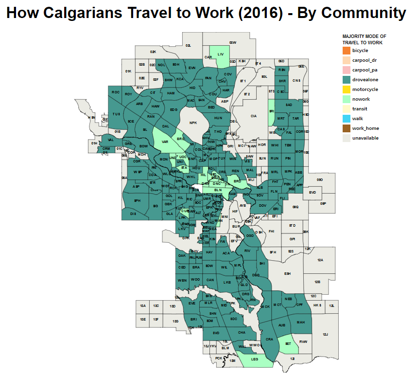

# CPSC583 - Introduction to Information Visualization (Fall 2019)
# Project 3 - Implementation

## Authors

[lawnguyen](https://github.com/lawnguyen)

[yimsbean](https://github.com/yimsbean)

## About

[Image: General Form]

- Visualization of CSV data using D3.js

- Consists of 4 forms, 1x[General Form] and 3x[Variation Form]
